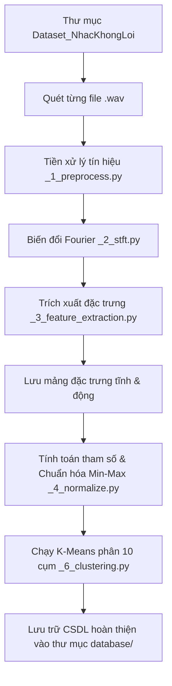
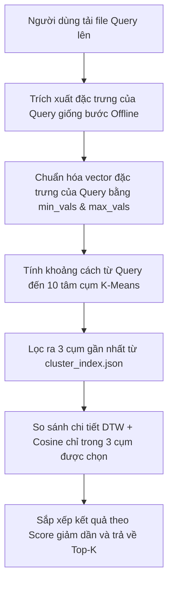

# TÀI LIỆU QUY TRÌNH XỬ LÝ VÀ KIẾN TRÚC HỆ THỐNG CHI TIẾT

Tài liệu này mô tả chi tiết quy trình xử lý dữ liệu của hệ thống, phân định vai trò nhiệm vụ của từng file, và chỉ rõ các đoạn code thực hiện nạp (load) dữ liệu tại các giai đoạn khác nhau.

---

## 1. Quy Trình Xử Lý Tuần Tự (Processing Pipeline)

Hệ thống hoạt động dựa trên hai quy trình cốt lõi độc lập: **Offline (Xây dựng CSDL)** và **Online (Tìm kiếm thời gian thực)**.

### 1.1. Quy trình Offline (Xây dựng Cơ sở dữ liệu)
Được kích hoạt khi chạy file `build_database.py`. Quy trình chạy qua các bước:



### 1.2. Quy trình Online (Tìm kiếm & Phản hồi)
Được kích hoạt khi người dùng tải file lên từ giao diện web (`app.py`) hoặc chạy kiểm thử (`search_optimized.py`):



---

## 2. Chi Tiết Vai Trò Của Từng Tệp Tin (File-by-File Responsibility)

Hệ thống được thiết kế theo dạng mô-đun hóa, mỗi file đảm nhận một bước xử lý chuyên biệt:

### 2.1. `_1_preprocess.py` (Tiền xử lý âm thanh thô)
* **Nhiệm vụ**: Đọc file âm thanh từ ổ cứng và làm sạch tín hiệu.
* **Các bước chi tiết**:
  1. Sử dụng `scipy.io.wavfile` để đọc biên độ và tần số lấy mẫu (`sample_rate`).
  2. Gộp kênh âm thanh Stereo thành Mono (nếu có) bằng cách lấy trung bình cộng.
  3. Chuẩn hóa biên độ âm thanh về dải $[-1, 1]$.
  4. Loại bỏ các khoảng lặng (trim silence) ở đầu/cuối dựa trên ngưỡng năng lượng.
  5. Áp dụng bộ lọc tiền nhấn (Pre-emphasis filter) để khuếch đại tần số cao.
  6. Chia tín hiệu thành các khung ngắn xếp chồng (Framing) với `frame_size=2048` và `hop_length=512`.
  7. Nhân từng khung với cửa sổ Hamming để tránh rò rỉ phổ.

### 2.2. `_2_stft.py` (Biến đổi miền tần số)
* **Nhiệm vụ**: Chuyển tín hiệu âm thanh từ miền thời gian sang miền tần số bằng phép biến đổi Fourier (FFT).
* **Các bước chi tiết**:
  1. Áp dụng thuật toán **Real FFT** trên từng khung tín hiệu.
  2. Tính trị tuyệt đối của kết quả FFT để lấy phổ biên độ (magnitude spectrum).
  3. Áp dụng phép chuyển đổi logarit: $\text{stft\_log} = \ln(1 + \text{magnitude})$ để tương thích với cảm nhận âm lượng của tai người.

### 2.3. `_3_feature_extraction.py` (Trích xuất đặc trưng)
* **Nhiệm vụ**: Trích xuất các thuộc tính nhạc lý từ phổ tần số để phân tích.
* **Đầu ra**:
  * **Vector tĩnh (Song-level) 18 chiều**: Gồm năng lượng hiệu dụng RMS (trung bình & độ lệch chuẩn), tốc độ qua điểm 0 ZCR (trung bình & độ lệch chuẩn), cao độ Pitch (trung bình & độ lệch chuẩn) và 12 thành phần Chroma trung bình toàn bài.
  * **Chuỗi động (Sequence)**: Mảng cao độ (`pitch_contour`) và ma trận hòa âm (`chroma_sequence`) theo từng khung thời gian.

### 2.4. `_4_normalize.py` (Chuẩn hóa dữ liệu)
* **Nhiệm vụ**: Đồng bộ hóa thang đo các thuộc tính.
* **Chi tiết**: Tính toán giá trị cực tiểu (Min) và cực đại (Max) trên toàn bộ ma trận đặc trưng tĩnh của CSDL và thực hiện chuẩn hóa Min-Max để đưa tất cả chiều về dải $[0, 1]$.

### 2.5. `_5_similarity.py` (So sánh độ tương đồng)
* **Nhiệm vụ**: Đo đạc mức độ giống nhau giữa 2 bài hát.
* **Chi tiết**:
  * Tính **Cosine Similarity** giữa 2 vector đặc trưng 18 chiều (thể hiện cấu trúc chung).
  * Tính khoảng cách uốn khớp thời gian **DTW (Dynamic Time Warping)** với Sakoe-Chiba Band trên chuỗi Pitch (thể hiện giai điệu).
  * Trả về điểm tổng hợp: $\text{Score} = 0.65 \times \text{Pitch\_sim} + 0.35 \times \text{Vector\_sim}$.

### 2.6. `_6_clustering.py` (Phân cụm dữ liệu)
* **Nhiệm vụ**: Thực hiện K-Means++ thủ công để gom nhóm bài hát và lập chỉ mục CSDL thành 10 cụm giúp giảm không gian tìm kiếm.

---

## 3. Các Đoạn Code Xử Lý Nạp (Load) Dữ Liệu Trong Hệ Thống

Để hệ thống chạy nhanh, các file cấu hình và chỉ mục được nạp sẵn vào bộ nhớ RAM ngay khi ứng dụng khởi chạy.

### 3.1. Các đoạn code nạp dữ liệu khi khởi động Server (`app.py`)

* **Nạp tham số chuẩn hóa Min-Max (Dòng 25 - 33)**:
  Nạp file `normalization.csv` để lấy các giá trị Min/Max phục vụ chuẩn hóa đặc trưng của file Query do người dùng tải lên.
  ```python
  min_vals, max_vals = [], []
  with open("database/normalization.csv", "r", encoding="utf-8") as f:
      reader = csv.reader(f)
      next(reader)
      for row in reader:
          min_vals.append(float(row[1]))
          max_vals.append(float(row[2]))
  min_vals = np.array(min_vals)
  max_vals = np.array(max_vals)
  ```

* **Nạp tâm cụm và Chỉ mục K-Means (Dòng 35 - 38)**:
  Tải ma trận tâm cụm (`cluster_centroids.npy`) để tính khoảng cách phân cụm nhanh, và file ánh xạ bài hát (`cluster_index.json`).
  ```python
  cluster_centroids = np.load("database/cluster_centroids.npy")
  with open("database/cluster_index.json", "r", encoding="utf-8") as f:
      cluster_index = json.load(f)
  ```

* **Nạp toàn bộ Vector đặc trưng tĩnh (Dòng 40 - 46)**:
  Đọc toàn bộ đặc trưng 18 chiều của các bài hát gốc trong CSDL lưu tại `audio_features.csv` để phục vụ tính Cosine Similarity.
  ```python
  db_features = {}
  with open("database/audio_features.csv", "r", encoding="utf-8") as f:
      reader = csv.reader(f)
      next(reader)
      for row in reader:
          db_features[row[0]] = list(map(float, row[1:]))
  ```

* **Nạp trước toàn bộ chuỗi đặc trưng giai điệu động vào RAM (Dòng 48 - 57)**:
  Để tránh việc phải đọc ghi đĩa cứng liên tục trong khi tìm kiếm (gây thắt nút cổ chai hiệu năng), hệ thống lặp qua toàn bộ bài hát và tải các file giai điệu `.npz` chứa chuỗi Pitch & Chroma động vào RAM.
  ```python
  db_sequences = {}
  seq_dir = "database/sequences"
  for fname in db_features.keys():
      seq_path = os.path.join(seq_dir, fname.replace('.wav', '.npz'))
      if os.path.exists(seq_path):
          data = np.load(seq_path)
          db_sequences[fname] = {"pitch": data['pitch'], "chroma": data['chroma']}
      else:
          db_sequences[fname] = None
  ```

### 3.2. Quá trình nạp dữ liệu tương tự trong file kiểm thử CLI (`search_optimized.py`)
* File `search_optimized.py` thực hiện quy trình nạp dữ liệu **giống hệt** như `app.py` từ **dòng 15 đến dòng 53** để đảm bảo kết quả tìm kiếm thông qua dòng lệnh hoàn toàn đồng bộ với kết quả hiển thị trên trang web.
