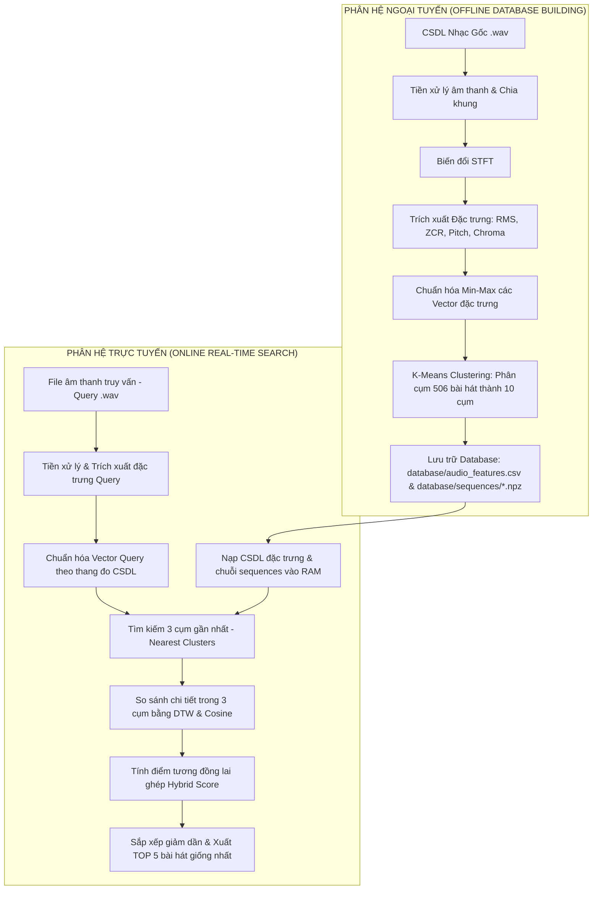
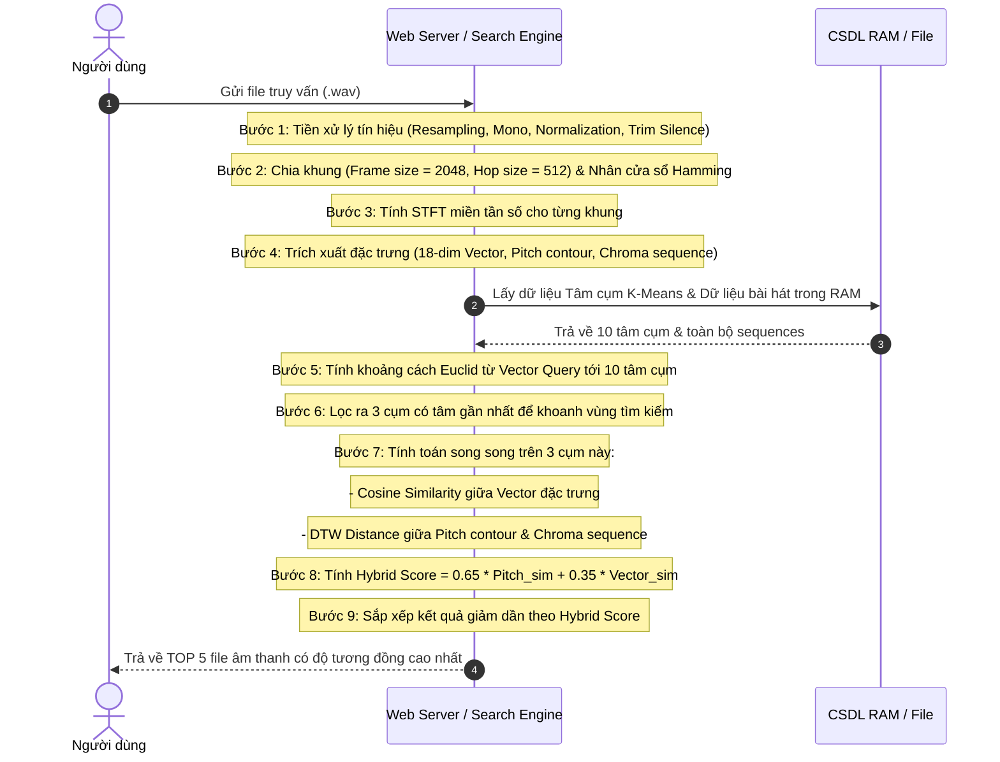

# BÁO CÁO KIẾN TRÚC VÀ QUY TRÌNH HỆ THỐNG TÌM KIẾM NHẠC TƯƠNG ĐỒNG

Báo cáo này làm rõ thiết kế hệ thống tìm kiếm nhạc tương đồng dựa trên nội dung (Content-Based Music Information Retrieval - CBMIR) sử dụng các đặc trưng âm thanh kết hợp giữa phân cụm K-Means++ và so khớp chuỗi thời gian DTW.

---

## PHẦN A: SƠ ĐỒ KHỐI VÀ QUY TRÌNH THỰC HIỆN CỦA HỆ THỐNG

Kiến trúc hệ thống được phân chia làm hai phân hệ chính: **Phân hệ Ngoại tuyến (Offline Phase)** để xây dựng cơ sở dữ liệu đặc trưng và **Phân hệ Trực tuyến (Online Phase)** để xử lý tệp truy vấn (Query) và tìm kiếm thời gian thực.

### 1. Sơ đồ khối tổng thể của hệ thống

---

### 2. Quy trình thực hiện cụ thể khi tìm kiếm

Quy trình xử lý đối với tệp truy vấn đầu vào (cho cả 2 trường hợp: bài hát **đã có** hoặc **chưa có** trong CSDL):

---

## PHẦN B: CÁC KẾT QUẢ TRUNG GIAN TRONG QUÁ TRÌNH TÌM KIẾM

Trong quá trình thực thi tìm kiếm trực tuyến, hệ thống sẽ tuần tự tạo ra các cấu trúc dữ liệu trung gian trong RAM để chuyển đổi thông tin từ sóng cơ học sang các đặc trưng toán học phục vụ đối sánh:

| Tên kết quả trung gian | Cấu trúc dữ liệu & Kích thước (Shape) | Ý nghĩa vật lý / Nhạc lý | Vai trò trong thuật toán |
| :--- | :--- | :--- | :--- |
| **1. Khung tín hiệu thô (Preprocessed Frames)** | Mảng 2D: $F \times 2048$  *(với $F$ là số khung hình)* | Đoạn sóng âm ngắn thời gian $93\text{ ms}$ đã lọc nhiễu, chuẩn hóa biên độ về $[-1, 1]$ và nhân cửa sổ Hamming để tránh rò rỉ phổ. | Làm dữ liệu đầu vào sạch cho phép biến đổi Fourier nhanh (FFT). |
| **2. Phổ biên độ logarit (Log STFT Spectrogram)** | Ma trận 2D: $F \times 1024$ | Năng lượng phân bổ trên 1024 dải tần số từ $0$ đến $11025\text{ Hz}$ theo từng khung thời gian. | Làm cơ sở trích xuất tần số giai điệu (F0) và nốt nhạc (Chroma). |
| **3. Chuỗi Cao độ gốc (Raw Pitch Contour - F0)** | Mảng 1D: $F$ phần tử | Chuỗi tần số của nốt nhạc chính (giọng ca sĩ/nhạc cụ chính) biến thiên theo thời gian (Hz). | Làm chuỗi dữ liệu động đầu vào cho giải thuật đối sánh giai điệu bằng DTW. |
| **4. Chuỗi Hòa âm (Chroma Sequence)** | Mảng 2D: $F \times 12$ | Năng lượng phân bổ trên 12 nốt nhạc cơ bản ($C, C^\sharp, D,..., B$) qua từng khung thời gian. | Đặc trưng cho hòa âm và hợp âm nền, giúp đối sánh bằng DTW Chroma. |
| **5. Vector Đặc trưng tĩnh (Normalized Song Vector)** | Mảng 1D: $18$ chiều  *(Dải trị $[0, 1]$)* | Thống kê tổng quan về bài hát: Giá trị trung bình/Độ lệch chuẩn của RMS, ZCR, Pitch và phân bổ trung bình Chroma 12 nốt. | Dùng để tính **Cosine Similarity** (phong cách nhạc) và phân cụm **K-Means**. |
| **6. Khoảng cách Euclid tâm cụm** | Mảng 1D: $10$ phần tử | Mức độ sai khác giữa bài hát Query với phong cách chủ đạo của 10 cụm nhạc trong CSDL. | Dùng để chọn nhanh 3 cụm gần nhất, giảm $70\%$ số lượng bài hát cần so khớp DTW chi tiết. |
| **7. Ma trận chi phí tích lũy DTW** | Ma trận 2D: $N \times M$  *(với $N, M$ là số khung của 2 bài)* | Tổng chi phí căn chỉnh nhịp độ tối thiểu lũy kế giữa khung $i$ của bài Query và khung $j$ của bài đối sánh. | Đường đi ngắn nhất trên ma trận này (Warping Path) cho ra khoảng cách DTW cuối cùng dùng để tính độ tương đồng giai điệu (`pitch_sim`). |

---

## Ý NGHĨA KHI FILE TRUY VẤN NẰM NGOÀI CƠ SỞ DỮ LIỆU
* **Nếu file truy vấn đã có trong CSDL**: Kết quả trả về chắc chắn sẽ có bài hát đó xếp ở vị trí **Top 1 với độ tương đồng 100.00%**, theo sau là 4 bài hát có giai điệu tương tự.
* **Nếu file truy vấn chưa có trong CSDL**: Quy trình trích xuất đặc trưng vẫn diễn ra hoàn toàn tương tự. Hệ thống sử dụng mô hình K-Means và chuẩn hóa dữ liệu dựa trên các tham số đã huấn luyện trước đó để định vị bài hát lạ này vào cụm phù hợp nhất, sau đó dùng DTW tìm ra 5 bài hát có cấu trúc giai điệu tương tự nhất trong CSDL mà không bị crash hay lỗi hệ thống. Điều này thể hiện tính **khái quát hóa (generalization)** cao của hệ thống đa phương tiện.
